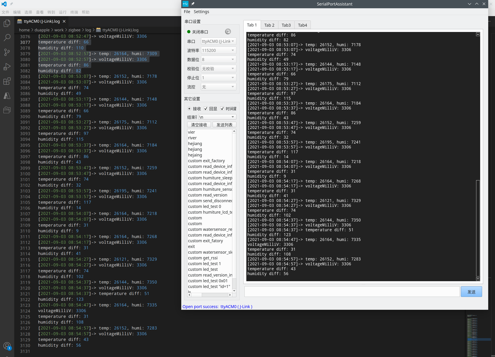

# 串口助手

**`2021-09-03`**

新增功能：

* 增加日志保存，优化时间戳显示。

  

* 增加程序多开。Settings页面启动新窗口。

* 增加接收显示暂停。由于是游戏内容就会刷新显示，因此当有新内容来时，无法停留在前面查看内容，因此可以使用暂停接收功能，接收内容会存放到buffer中，当解除该状态后，会一次性刷新内容。

待新增：

* Tab标签页多开串口。

**`First`**

## 需要新增的功能

* `ctrl+c` 快捷键发送 `ctrl+c`。
* `\r\n` 结尾的字符串去掉 `\r`。

